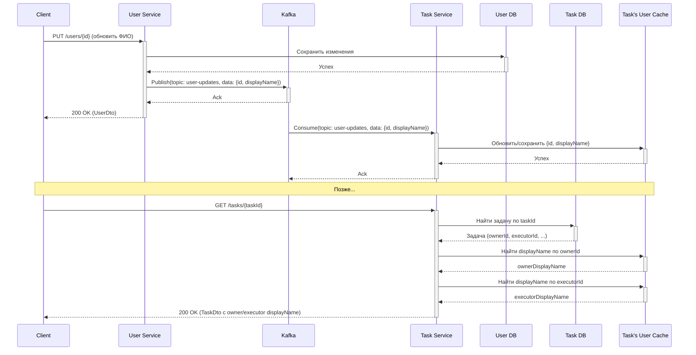

# Архитектура и взаимодействие микросервисов

## Обзор

Система состоит из двух независимых микросервисов:

1.  **User Service**: Отвечает за управление данными пользователей.
2.  **Task Service**: Отвечает за управление задачами.

Оба сервиса имеют собственные базы данных PostgreSQL и предоставляют REST API для внешних клиентов (например, UI).

## Принцип независимости

Ключевое требование - **отсутствие прямых синхронных вызовов** между сервисами во время обработки REST API запроса. Если `user-service` недоступен, `task-service` должен продолжать работать (и наоборот), обслуживая свои запросы.

## Асинхронное взаимодействие через Kafka

Несмотря на независимость при обработке API-запросов, сервисам необходимо обмениваться информацией для обеспечения полноты данных (например, `task-service` должен знать имена владельцев/исполнителей задач).

Это достигается через **асинхронный обмен сообщениями** с использованием **Apache Kafka**.

### Сценарий: Обновление информации о пользователе в Task Service

1.  **Событие в User Service**: Пользователь изменяет свои данные (например, фамилию) через `PUT /users/{id}`.
2.  **Публикация в Kafka**: `user-service` после успешного сохранения изменений в своей БД публикует сообщение (событие) в специальный топик Kafka (например, `user-updates`). Сообщение содержит актуальные данные пользователя (как минимум ID и поля, необходимые для отображения в `task-service`, например, `id`, `displayName`).
3.  **Потребление в Task Service**: `task-service` подписан на топик `user-updates`.
4.  **Обновление локальных данных**: Получив сообщение, `task-service` обновляет свою локальную таблицу/кэш (например, `user_info`), где хранится упрощенная информация о пользователях, необходимая для отображения в задачах (`userId`, `displayName`).
5.  **Отображение в Task API**: Когда пользователь запрашивает задачу (`GET /tasks/{id}`), `task-service` берет `ownerId` и `executorId` из данных задачи, находит соответствующую информацию в своей локальной таблице `user_info` и вставляет ее в `TaskDto` (`owner`, `executor` поля).

### Преимущества такого подхода

*   **Отказоустойчивость**: Недоступность одного сервиса не блокирует работу другого.
*   **Масштабируемость**: Сервисы можно масштабировать независимо друг от друга.
*   **Слабая связанность**: Сервисы минимально зависят от деталей реализации друг друга.

### Возможные проблемы

*   **Согласованность в конечном счете (Eventual Consistency)**: Данные о пользователе в `task-service` могут обновиться с некоторой задержкой после их изменения в `user-service`. Это приемлемо для данного сценария, так как отображение слегка устаревшего имени не является критичным.
*   **Обработка ошибок в Kafka**: Нужны механизмы для обработки ошибок при публикации/потреблении сообщений (retry, dead-letter queue). 